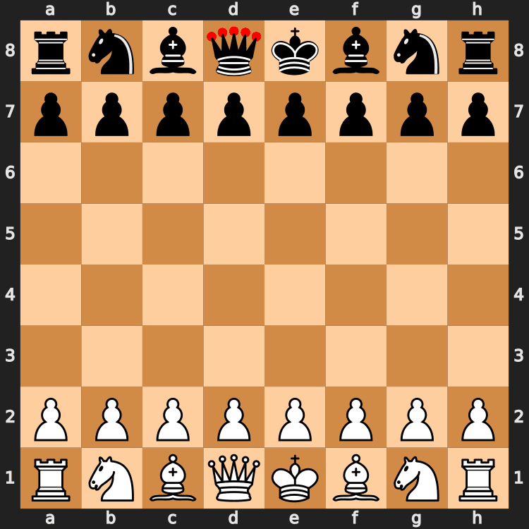

# pgn-to-gif

Generate GIFs of chess games from PGN files.

## Installation

`pip3 install pgn-to-gif`

## Example output


## Usage

```shell
usage: cli.py [-h] [--input-file INPUT_FILE] [--output-file OUTPUT_FILE] [--from-clipboard] [--add-initial-position]
              [--highlight-last-move] [--orientation {white,black}] [--size SIZE] [--coordinates]
              [--css-path CSS_PATH] [--loop LOOP] [--duration DURATION] [--fps FPS] [--palettesize PALETTESIZE]
              [--subrectangles] [--processes PROCESSES]

options:
  -h, --help            show this help message and exit
  --input-file INPUT_FILE
                        path to pgn file to read (default: None)
  --output-file OUTPUT_FILE
                        path to gif file to save (default: ./game.gif)
  --from-clipboard      Read PGN from clipboard (default: False)
  --add-initial-position
                        add initial position to gif (default: True)
  --highlight-last-move
                        highlight last move on board (default: False)
  --orientation {white,black}
                        orientation of board (default: white)
  --size SIZE           size of board (default: 400)
  --coordinates         add board coordinates (default: true)
  --css-path CSS_PATH   path to css file to style board (default: None)
  --loop LOOP           number of loops for gif, 0 means infinite (default: 0)
  --duration DURATION   duration of each frame (in seconds) in gif (default: 1.0)
  --fps FPS             frame per second of gif (default: 1.0)
  --palettesize PALETTESIZE
                        number of colors to quantize images to (default: 64)
  --subrectangles       optimize gif by storing change (default: None)
  --processes PROCESSES
                        number of processes when converting svgs to pngs (default: 1)
```

Please see [examples](https://github.com/afozk95/pgn-to-gif/tree/master/examples) folder.